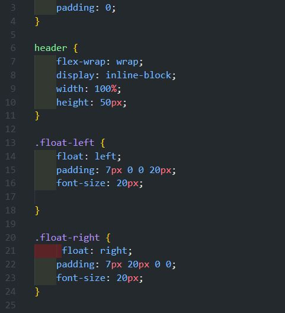
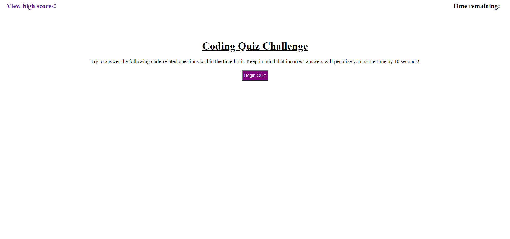

# 04-Web-APIs-Code-Quiz
## Introduction:
In this repo our job was  to build a timed coding quiz with multiple-choice questions. This app will run in the browser and will feature dynamically updated HTML and CSS powered by JavaScript code. 

We created a static website that you can view on this link:
 [04-Web-APIs-Code-Quiz](https://killjoyangel.github.io/04-Web-APIs-Code-Quiz/)

## Technologies used:
* HTML
* CSS
* Java Script

### Created HTML  Code
![screenshot] (assets/img/htmlthumb.JPG)

### Created CSS code

### Created JS 

## Final Product

